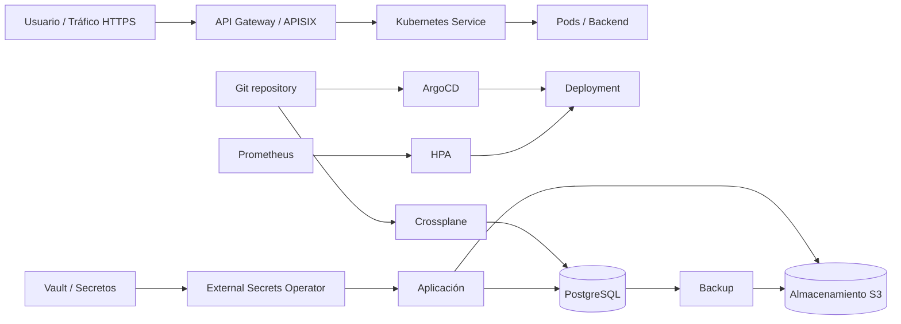

# ProyectosAG · Visualizador de Arquitectura Kubernetes/GitOps


Aplicación desarrollada con **React + TypeScript** para visualizar de forma interactiva una arquitectura **Kubernetes/GitOps**, mostrando componentes, relaciones y dependencias entre capas de plataforma.

## ✨ Características principales

- Visualización de arquitectura por capas (entrada, GitOps, seguridad, cómputo, persistencia y observabilidad).
- Nodos y conexiones con React Flow para seguir flujos técnicos de punta a punta.
- Búsqueda de componentes por nombre/recurso.
- Filtros por categoría/capa para enfocar el análisis.
- Panel de detalles al seleccionar nodos.
- Controles de navegación (zoom, minimapa y ajuste de vista).
- Botón de **Auto Layout** en interfaz y utilidad basada en **Dagre** disponible en el código para disposición automática.

## 🧰 Stack tecnológico

Según `package.json`, el proyecto utiliza:

- **React 19** (`react`, `react-dom`)
- **TypeScript**
- **Vite**
- **React Flow** (`@xyflow/react`)
- **Tailwind CSS**
- **Lucide React**
- **Dagre**

## 🏗️ Arquitectura por capas

| Capa | Propósito | Ejemplos de componentes |
|---|---|---|
| Entrada y API | Recibir tráfico externo y enrutarlo | HTTPS, API Gateway/APISIX, Kubernetes Service |
| GitOps y Control Plane | Sincronizar estado declarativo y despliegues | Git repository, ArgoCD, Crossplane |
| Seguridad y secretos | Gestionar credenciales y acceso | Vault, External Secrets Operator, RBAC |
| Cómputo y aplicación | Ejecutar backend y escalar según carga | Deployment, Pods, HPA |
| Persistencia y almacenamiento | Guardar datos transaccionales y objetos | PostgreSQL, S3, backups |
| Observabilidad | Medir salud/carga para autoscaling | Prometheus |

## 🔄 Flujo general (Mermaid)



## 🚀 Instalación y ejecución

```bash
npm install
npm run dev
```

Comandos disponibles:

```bash
npm run build
npm run lint
npm run preview
```

## 📁 Estructura del proyecto

Estructura base verificada en el repositorio:

```text
.
├── public/
├── src/
│   ├── components/
│   ├── assets/
│   ├── architectureData.ts
│   ├── App.tsx
│   ├── layout.ts
│   ├── main.tsx
│   └── types.ts
├── index.html
├── package.json
├── vite.config.ts
├── tailwind.config.js
├── tsconfig.json
├── tsconfig.app.json
└── tsconfig.node.json
```

## 🧭 Cómo funciona la interacción

1. El usuario explora el diagrama navegando por capas y relaciones.
2. Puede filtrar por categoría y buscar componentes desde la barra lateral.
3. Al seleccionar un nodo, se abre un panel con metadatos técnicos.
4. Los enlaces visuales permiten seguir el flujo entre entrada, despliegue, seguridad, cómputo y persistencia.

> Nota: algunas capacidades de layout automático están contempladas en el diseño del proyecto y en utilidades del código (Dagre), mientras que la interfaz actual prioriza un layout inicial curado y su restauración rápida.
