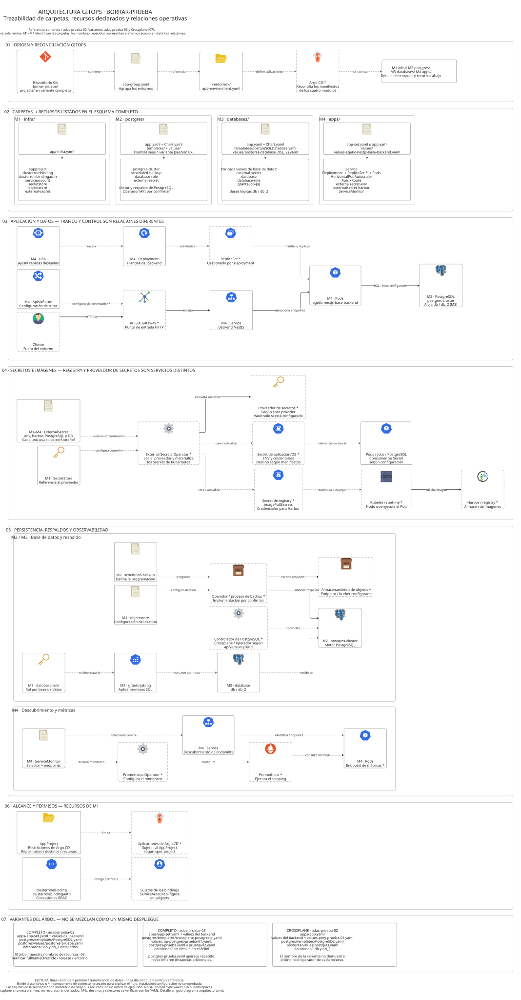

# Arquitectura GitOps de borrar-prueba

El entregable es **una sola lámina de arquitectura lógica**, trazable a las cuatro carpetas del esquema. El fuente canónico es [arquitectura-completo.d2](arquitectura-completo.d2). Esta guía muestra su SVG y documenta el mismo modelo; no contiene otra implementación en Mermaid.

[Ver SVG vectorial completo](arquitectura-completo.svg) · [Ver PNG](arquitectura-completo.png) · [Editar fuente D2](arquitectura-completo.d2)

## 1. Qué se corrigió y por qué los resultados eran distintos

| Problema anterior | Corrección |
| --- | --- |
| La guía tenía un grafo Mermaid y una paleta distintos a los tres fuentes D2. | Se retira el grafo duplicado. La guía incorpora el SVG canónico. |
| Los tres D2 repetían componentes y conexiones con nombres y alcances diferentes. | Se conserva una única fuente canónica: `arquitectura-completo.d2`. |
| Las cuadrículas ELK conectaban celdas lejanas con segmentos rectos que atravesaban componentes. | Las relaciones se enrutan dentro de grafos ELK independientes. Las cuadrículas organizan la lámina y el inventario; sus únicas conexiones entre celdas son las cuatro flechas verticales adyacentes de origen a recursos. |
| Se afirmaba “sin fondos de color”, pero seguían aplicándose los rellenos del tema. | Fondo y contenedores blancos explícitos, texto y bordes neutros; color únicamente en los iconos. |
| HPA apuntaba a Pods. | HPA → Deployment → ReplicaSet → Pods. ReplicaSet se identifica como contexto del mecanismo de Kubernetes. |
| ApisixRoute figuraba como un salto de tráfico entre gateway y Service. | ApisixRoute configura APISIX mediante su controlador. El tráfico sigue Cliente → Gateway → Service → Pods. |
| ServiceMonitor parecía realizar scraping o recibir métricas de la aplicación. | ServiceMonitor selecciona un Service; Prometheus Operator configura Prometheus; Prometheus consulta los endpoints. |
| SecretStore, ExternalSecret, operador y Secret se confundían. Harbor se mezclaba con Vault. | Se separan la configuración de proveedor, el recurso declarativo, ESO, el Secret resultante y el registry. Kubelet/runtime solicita las imágenes. |
| ObjectStore se equiparaba al almacenamiento externo y el respaldo se asumía un CronJob/dump. | Se distingue la configuración del destino del endpoint/bucket externo. El proceso de backup queda condicionado al operador real. |
| Se infería Crossplane para toda la infraestructura, HA, aislamiento y orden de despliegue. | Sólo se representa lo indicado por el árbol y se marca el contexto. API, controlador, réplicas, subjects y sync waves requieren los YAML. |

La [documentación de D2 sobre cuadrículas](https://d2lang.com/tour/grid-diagrams/) explica la limitación de conexiones rectas entre celdas con ELK/Dagre. Validar la sintaxis no basta para detectar estos problemas: hay que compilar y revisar la imagen.

## 2. Alcance y lectura del diagrama

La referencia con mayor detalle es **“apps - completo”, adas-prueba-02**. El esquema también incluye adas-prueba-03 y la variante denominada “apps - cossplane”, normalizada aquí como **Crossplane**. No se combinan sus archivos como si fueran una única configuración desplegada.

El material disponible es el árbol proporcionado y estos archivos de documentación. Los YAML reales no están en esta carpeta. Por ello, la lámina representa la arquitectura lógica esperada a partir del inventario, no una inspección del clúster.

- **M1:** infra/.
- **M2:** postgres/.
- **M3:** databases/.
- **M4:** apps/.
- **Flecha continua:** petición o transferencia de datos. En consultas, apunta desde quien solicita hacia el servicio consultado.
- **Flecha discontinua:** control, configuración, selección o referencia.
- **Borde discontinuo o asterisco:** componente de contexto cuyo despliegue o configuración no se ha comprobado.
- **Nombres repetidos:** el mismo recurso explicado en otra relación. Por ejemplo, los Pods de tráfico, secretos y métricas no representan tres Deployments distintos.

Las secciones son partes de una única lámina: 01 origen GitOps; 02 inventario de módulos; 03 aplicación y datos; 04 secretos e imágenes; 05 persistencia y observabilidad; 06 permisos; 07 variantes. Los identificadores M1–M4 mantienen la trazabilidad entre secciones. No se dibujan flechas largas entre paneles: su relación se identifica mediante esos nombres estables.

Los límites visuales representan responsabilidades y carpetas. **Una carpeta de entorno no demuestra un clúster, namespace o aislamiento de red.** Tampoco se deduce un orden de sincronización de Argo CD de la numeración M1–M4.

## 3. Mapeo de carpetas a recursos

Rutas relativas al directorio del entorno, salvo app-group.yaml, situado en borrar-prueba/. En la variante completo, borrar-prueba/ está dentro de projects/.

| Módulo | Entrada del repositorio | Recursos enumerados en “completo” |
| --- | --- | --- |
| Orquestación | app-group.yaml → &lt;entorno&gt;/app-environment.yaml | Referencias de agrupación y entorno. Revisar kind y spec antes de afirmar Application/ApplicationSet. |
| M1 infra/ | app-infra.yaml | appproject, clusterrolebinding, clusterrolebindingauth, objectstore, secretstore, serviceaccount, external-secret. |
| M2 postgres/ | app.yaml, Chart.yaml, templates/ y values/ según variante | postgres-cluster, scheduled-backup, database-role, external-secret. |
| M3 databases/ | app.yaml, Chart.yaml, templates/postgreSQLDatabase.yaml y un values por base | Por cada base: external-secret, database, database-role y grants-job-pg. |
| M4 apps/ | app-set.yaml o app.yaml y values de la aplicación | Service, Deployment, Pods, HPA, ApisixRoute, externalsecret-env, externalsecret-harbor y ServiceMonitor. |

Los nombres del inventario no siempre son kinds de Kubernetes. En particular, **clusterrolebindingauth** se conserva tal como aparece; no se inventa una API de ese nombre. AppProject pertenece a Argo CD y no equivale a una NetworkPolicy. AppProject restringe aplicaciones; un ClusterRoleBinding vincula permisos de un ClusterRole a sus subjects.

En Kubernetes un Deployment administra ReplicaSets y éstos administran Pods. El árbol abrevia ese nivel; la lámina lo explicita con un asterisco. El tipo de Service, el puerto SQL, el endpoint de métricas y la cantidad de réplicas se dejan sin fijar porque no se aportó su configuración.

## 4. Archivos por variante

### Completo / adas-prueba-02

Base: projects/borrar-prueba/adas-prueba-02/.

| Ubicación | Archivos |
| --- | --- |
| Raíz del entorno | app-environment.yaml |
| apps/ | app-set.yaml |
| apps/values/ | values-agetic-nestjs-base-backend.yaml |
| databases/ | app.yaml, Chart.yaml |
| databases/templates/ | postgreSQLDatabase.yaml |
| databases/values/ | postgres-database_db.yaml, postgres-database_db_2.yaml |
| infra/ | app-infra.yaml |
| postgres/ | app.yaml, Chart.yaml |
| postgres/templates/ | PostgreSQL.yaml |
| postgres/values/ | postgres-prueba.yaml |

app-group.yaml está en projects/borrar-prueba/.

El árbol proporciona estos nombres concretos para la aplicación:

- service/agetic-nestjs-base-backend-adas-prueba-03-service
- deployment.apps/agetic-nestjs-base-backend-adas-prueba-03-deploy
- pod/agetic-nestjs-base-backend-adas-prueba-03-deploy-6479d685fpdrd4
- horizontalpodautoscaler.autoscaling/agetic-nestjs-base-backend-adas-prueba-03-hpa

**Inconsistencia pendiente del esquema:** los nombres contienen adas-prueba-03 aunque están bajo adas-prueba-02. Se conserva la observación; no se renombra un recurso sin comprobar release, namespace, fullnameOverride y values. El nombre del Pod contiene un sufijo variable y se conserva aquí como ejemplo suministrado, no como identificador estable de arquitectura.

### Completo / adas-prueba-03

Base: projects/borrar-prueba/adas-prueba-03/.

| Ubicación | Archivos |
| --- | --- |
| Raíz del entorno | app-environment.yaml |
| apps/ | app-set.yaml |
| apps/values/ | values-agetic-nestjs-base-backend.yaml |
| databases/ | Carpeta presente; sin archivos detallados en el árbol. |
| infra/ | app-infra.yaml |
| postgres/ | app.yaml, Chart.yaml |
| postgres/templates/ | crossplane-postgresql.yaml |
| postgres/values/ | op-postgres-prueba-01.yaml, postgres-prueba.yaml, prueba-02.yaml |

postgres-prueba.yaml aparece varias veces en el texto de origen. En el inventario normalizado se registra una ruta única; no se deducen dos clústeres por esa repetición ni se asignan recursos a cada values sin sus contenidos.

### Crossplane / adas-prueba-02

Base suministrada: borrar-prueba/adas-prueba-02/. El segundo árbol no muestra el prefijo projects/.

| Ubicación | Archivos |
| --- | --- |
| Raíz del entorno | app-environment.yaml |
| apps/ | app.yaml |
| apps/values/ | values-agetic-nestjs-base-backend.yaml, values-proy-prueba-01.yaml |
| databases/ | app.yaml, Chart.yaml |
| databases/templates/ | postgreSQLDatabase.yaml |
| databases/values/ | postgres-database_db.yaml, postgres-database_db_2.yaml |
| infra/ | app-infra.yaml |
| postgres/ | app.yaml, Chart.yaml |
| postgres/templates/ | PostgreSQL.yaml |
| postgres/values/ | postgres.yaml |

app-group.yaml está en borrar-prueba/. Esta variante sólo enumera archivos; **no enumera sus recursos renderizados**. El inventario de recursos de la sección 02 procede de “completo”. El nombre “Crossplane” y un archivo crossplane-postgresql.yaml no prueban que todos los recursos sean reconciliados por Crossplane.

## 5. Relaciones que deben verificarse en los YAML

El sentido de las flechas sigue el funcionamiento de los componentes; sus referencias concretas dependen de los manifiestos:

| Relación de la lámina | Comprobación en manifiestos |
| --- | --- |
| app-group → app-environment → módulos | kind, spec.source/spec.sources, paths, generators/templates si existen y destino de cada aplicación. |
| HPA → Deployment | spec.scaleTargetRef. |
| APISIX → Service → Pods | Backends de ApisixRoute; selector del Service, puertos y labels de Pods. La configuración se aplica mediante el controlador APISIX. |
| Pods → PostgreSQL | Host/base de datos en variables o Secrets, servicio de conexión y puerto efectivo. No se asume que el backend use simultáneamente db y db_2. |
| SecretStore/ExternalSecret → ESO → Secret | spec.provider, secretStoreRef y spec.target; envFrom/env/volumes e imagePullSecrets de cada consumidor. |
| ServiceMonitor → Service; Prometheus → endpoints | Selectores de ServiceMonitor y de Prometheus, namespaceSelector, endpoints y puertos de métricas. |
| database/database-role/grants-job-pg → PostgreSQL | apiVersion, kind, referencias al motor, rol destino y comandos del Job. |
| scheduled-backup/objectstore → respaldo externo | API y operador, referencia al clúster, programación, destino y credenciales. No asumir CronJob, dump o creación automática de buckets. |
| AppProject y bindings | spec.project de aplicaciones, destinations, repositorios, roleRef y subjects. No se afirma que todos los bindings apunten al ServiceAccount listado. |

Las flechas no representan respuestas HTTP/SQL, tráfico de retorno ni todas las interacciones de los controladores. Esto conserva la legibilidad sin cambiar el significado de las relaciones representadas.

## 6. Estándar de edición y generación

1. Editar únicamente arquitectura-completo.d2 para cambiar el diagrama.
2. Actualizar esta guía si cambia el inventario, los nombres o el alcance.
3. Mantener M1–M4 y los nombres lógicos; no copiar hashes de Pods a las etiquetas principales.
4. Usar fondo blanco, bordes neutros, tipografía y clases compartidas del fuente. Los iconos mantienen sus colores originales.
5. Usar etiquetas cortas y saltos de línea explícitos. Conservar los nombres completos en esta guía.
6. Enrutar cada relación dentro de su panel. No conectar celdas lejanas de las cuadrículas con ELK.
7. Ejecutar el generador y revisar SVG/PNG a tamaño legible. No editar a mano los SVG.
8. Ejecutar la comprobación de actualidad antes de entregar.

Se utiliza **D2 v0.9.0 + ELK**, con espaciado y parámetros fijados en [generar-diagramas.ps1](generar-diagramas.ps1). Se puede instalar D2 siguiendo su [documentación oficial](https://github.com/d2lang/d2/blob/master/docs/INSTALL.md); este proyecto no necesita Mermaid CLI ni paquetes npm.

Desde PowerShell, dentro de esta carpeta:

~~~powershell
d2 --version
.\generar-diagramas.ps1

# Comprobar sin reemplazar los entregables:
.\generar-diagramas.ps1 -Comprobar
~~~

El script:

- Valida y compila `arquitectura-completo.d2` en un directorio temporal.
- Comprueba que el SVG sea XML válido y tenga sus imágenes incorporadas.
- Genera arquitectura-completo.png, verificando también la compatibilidad de los iconos con el exportador raster.
- Reemplaza los entregables después de completar las comprobaciones. Con -Comprobar sólo detecta archivos ausentes o desactualizados.

| Archivo | Función |
| --- | --- |
| arquitectura-completo.d2 | Única fuente editable del diagrama. |
| arquitectura-completo.svg | Entregable vectorial canónico. |
| arquitectura-completo.png | Vista raster para compartir. |
| guia-diagrama-arquitectura.md | Guía e inventario; incorpora el SVG canónico. |
| generar-diagramas.ps1 | Generación y detección de entregables desactualizados. |
| assets/icons/ | Iconos locales con procedencia y hashes. |

## 7. Iconos y fuentes técnicas

D2 sí ofrece un [catálogo de iconos](https://icons.d2lang.com/) y permite [usar imágenes locales mediante icon](https://d2lang.com/tour/icons/). La lámina combina ese catálogo con [iconos oficiales de Kubernetes](https://github.com/kubernetes/community/tree/master/icons) y [logos de CNCF](https://github.com/cncf/artwork). No depende de un plugin de iconos.

Las copias locales y sus adaptaciones para D2 están documentadas en [assets/icons/README.md](assets/icons/README.md) y [origenes.json](assets/icons/origenes.json). Los SVG finales incorporan las imágenes; se pueden abrir sin conexión.

Referencias que sustentan el significado de las conexiones:

- [D2: cuadrículas y sus conexiones](https://d2lang.com/tour/grid-diagrams/).
- [D2: ELK y rutas ortogonales](https://d2lang.com/tour/elk/).
- [Kubernetes: Horizontal Pod Autoscaling](https://kubernetes.io/docs/concepts/workloads/autoscaling/horizontal-pod-autoscale/).
- [Apache APISIX: API de recursos del Ingress Controller](https://apisix.apache.org/docs/ingress-controller/reference/apisix-ingress-controller/api-reference/).
- [External Secrets: ExternalSecret](https://external-secrets.io/latest/api/externalsecret/).
- [Prometheus Operator: ServiceMonitor y descubrimiento](https://prometheus-operator.dev/docs/developer/getting-started/).
